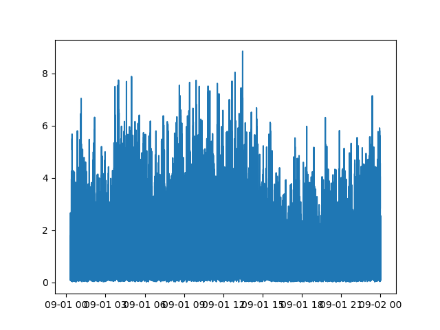

*UNDER DEVELOPMENT!*

Computes and plots atmospheric turbulent statistics for high frequency data. 

*ADD MORE HERE!*

# Installation 

```bash
conda create --name tower jupyter -y
conda activate tower
conda install -c conda-forge pandas
conda install -c conda-forge xarray dask netCDF4 bottleneck
conda install -c conda-forge matplotlib
conda install -c conda-forge numpy
```
Then clone this repository.

# Test case

The code below generates an artificial data which is simular to the real one, print and plot the resoult . The output of `ats.plot.simple` is pandas DataFrame with time as index and random generated data 'u' (with cosine as longwave variability. Optionally a linear trend can be set: trend=True). 
```python
import ats_lib as ats

time_start = "2020-08-31 20:00:00"
time_end = "2020-08-31 21:00:00"
frequency=20

# Create data
data = ats.test.create(time_start,time_end,frequency, trend=False) 
print(data)

# Plot data
plt = ats.plot.simple(data, label="test data")
plt.legend()
plt.show()

```


Create data with gaps with `ats.test.gap` the gap size of `gap_size` time steps:
```python
import ats_lib as ats

time_start = "2020-08-31 20:00:00"
time_end = "2020-08-31 21:00:00"
frequency=20

# Create data
data = ats.test.create(time_start,time_end,frequency, trend=False) 
plt = ats.plot.simple(data, label="test data")

# Add gap
data_bad = ats.test.gap(data, gap_size=10000)

# Plot data
plt = ats.plot.simple(data, label="test data with gaps")
plt.legend()
plt.show()
```


By default the gap has middle location. If optional location or/and more then one gap is needed -- use `gap_start` parameter: 


```python

...

# Add gap with location
data_bad = ats.test.gap(data, gap_start="2020-08-31 20:05:00", gap_size=15000)
# Add another gap with different location:
data_bad = ats.test.gap(data_bad, gap_start="2020-08-31 20:45:00", gap_size=5000)

# Plot data
plt = ats.plot.simple(data_bad, label="test data with gaps")
plt.legend()
plt.show()
```


# Real data case
Dealing with the real data is almost the same. The script below reads the NetCDF of raw data (`ats.reader.netcdf`), the `ats.data.clean` is necessary to drop duplicates and set time in acceding order (in case glitches at the data-collector site) -- use it every time you read the raw (L0) data! The `ats.math.primes` computes fluctuations where `window` in the average window in time steps (here window=20 mins). Data could be detrended *but now only using average value - WE NEED TO IMPROVE THAT INTO REGRESSION!*. Finally the `ats.math.tke` computes the TKE (the `data_primes` array has to have u, v and w as primes).


```python
import ats_lib as ats

frequency=20
filename = "./data/L0/MSU/A1/2022/09/MSU_A1_2022-09-01.nc"

# Read the data
data_raw = ats.reader.netcdf(filename)

# Clean the data (in case of duplicates and time reorders)
data = ats.data.clean(data_raw)

# Get fluctuations with detrend as mean.
data_primes = ats.math.primes(data, window=frequency*20*60, detrend="mean")
print(data_primes)

# Compute TKE
data_tke = ats.math.tke(data_primes)

print(data_tke)

# plot the result:
plt = ats.plot.simple(data_tke['tke'], label="KTE")
plt.show()

```




# Agenda
1. `ats.math.primes`:
   * 1.1 Add regression detrend
   * 1.2 Change running window into jumping window! Using pandas.
2. ats.math class:
   * 2.1 Add other statistics