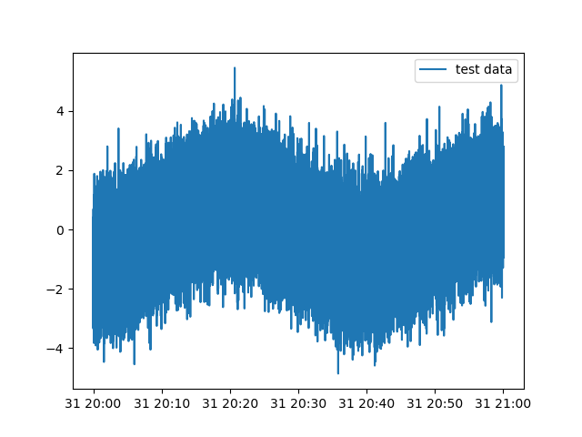
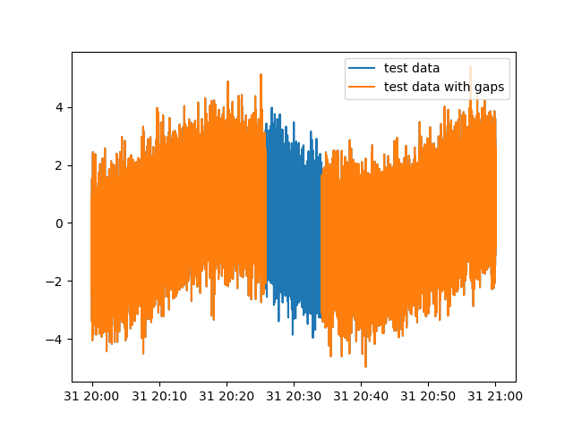
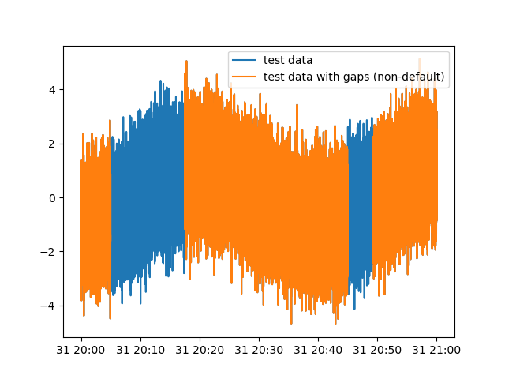

*UNDER DEVELOPMENT!*

Computes and plots atmospheric turbulent statistics for high frequency data. 
*ADD MORE HERE!*

# Installation 

```bash
conda create --name tower jupyter -y
conda activate tower
conda install -c conda-forge pandas
conda install -c conda-forge xarray dask netCDF4 bottleneck
conda install -c conda-forge matplotlib
conda install -c conda-forge numpy
```
Then clone this repository.

# Test case

The code below generates an artificial data which is simular to the real one, print and plot the resoult . The output of `ats.plot.simple` is pandas DataFrame with time as index and random generated data 'u' (with cosine as longwave variability. Optionally a linear trend can be set: trend=True). 
```python
import ats_lib as ats

time_start = "2020-08-31 20:00:00"
time_end = "2020-08-31 21:00:00"
frequency=20

# Create data
data = ats.test.create(time_start,time_end,frequency, trend=False) 
print(data)

# Plot data
plt = ats.plot.simple(data, label="test data")
plt.legend()
plt.show()

```




Create data with gaps with `ats.test.gap` the gap size of `gap_size` time steps:
```python
import ats_lib as ats

time_start = "2020-08-31 20:00:00"
time_end = "2020-08-31 21:00:00"
frequency=20

# Create data
data = ats.test.create(time_start,time_end,frequency, trend=False) 
plt = ats.plot.simple(data, label="test data")

# Add gap
data_bad = ats.test.gap(data, gap_size=10000)

# Plot data
plt = ats.plot.simple(data, label="test data with gaps")
plt.legend()
plt.show()
```




By default the gap has middle location. If optional location or/and more then one gap is needed -- use `gap_start` parameter: 


```python

...

# Add gap with location
data_bad = ats.test.gap(data, gap_start="2020-08-31 20:05:00", gap_size=15000)
# Add another gap with different location:
data_bad = ats.test.gap(data_bad, gap_start="2020-08-31 20:45:00", gap_size=5000)

# Plot data
plt = ats.plot.simple(data_bad, label="test data with gaps")
plt.legend()
plt.show()
```




# Real data case
*ADD MORE HERE!*

# Agenda
1. Add test data
2. 